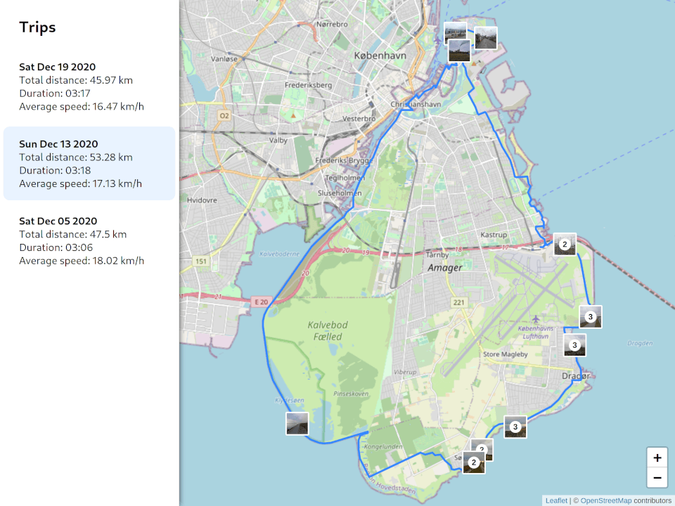
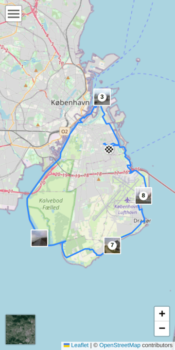

# Trip Share

A web application for displaying photos and GPX tracks on the map.

## Preview

| Desktop                               | Mobile                              |
| ------------------------------------- | ----------------------------------- |
|  |  |

You can also see a demo at https://zelent.net/trips.

## Description

The idea of the application came when I wanted to share my bike trips with my
family and friends. I needed an easy way to display the route on a map and the
photos I've taken on the trip. I record my bike trips using
[OSMAnd](https://osmand.net/) navigation app and take photos with the location
saved in the image metadata.

The application displays the route recorded with GPS in the GPX format on an
interactive map. The photos are displayed as markers in places they have been
taken, and when clicked on, they are opened in a slideshow view. It is usable
both on desktop and mobile.

The application was developed using [Node.js](https://nodejs.org/),
[TypeScript](https://www.typescriptlang.org/), and
[React](https://reactjs.org/). The map was created with
[Leaflet](https://leafletjs.com/), the gallery is displayed using [PhotoSwipe](https://photoswipe.com/).

## Generating data

The data displayed in the application can be generated using a script `generate-data.ts` located in the `src` directory.

The script is processing photos using the [sharp](https://sharp.pixelplumbing.com/) image processing module. It optimizes and resizes the images, extracts the geolocation and captions from the EXIF metadata, and generates thumbnails. Similarly, videos are resized and reencoded to the WebM format using [ffmpeg](https://ffmpeg.org/). The script also converts GPX files into GeoJSON format that can be displayed by Leaflet. Some information like the duration of the trip, the distance, and the average speed is calculated based on that data. Finally, the script outputs an `index.json` file that lists all groups of the trip, the media files, geo data, and metadata.

The script expects the following file structure inside the input folder:

```
trip/
├── day-01/
│   ├── day-01.gpx
│   ├── photo-1.jpg
│   ├── photo-2.jpg
│   ├── photo-3.jpg
├── day-02/
│   ├── day-02.gpx
├── day-03/
│   ├── photo-1.jpg
│   ├── photo-2.jpg
```

A trip is considered as the main collection while groups can be used to split the trip into smaller parts to be displayed, e.g. a longer journey can be split into days, or semi-regular bike trips can be organized into groups based on the occurrences.

To run the script you need to use [ts-node](https://typestrong.org/ts-node/) and provide it with arguments for the input folder, the output folder, and the path to the files to the server (where they should be downloaded from, e.g. `/my-trips/summer-trip` or `example.com/my-trips/summer-trip`):

```
npx ts-node ./src/generate-data.ts [INPUT_PATH] [OUTPUT_PATH] [SERVER_PATH]
```

When the script finishes, the index file for the trip should be present in the output directory. It will have a structure like this:

```
{
  "id": "bike-trips",
  "name": "Bike trips",
  "groups": [
    {
      "id": "2020-12-05",
      "name": "2020-12-05",
      "media": [
        {
          "name": "20201205_140107.jpg",
          "src": "/data/bike-trips/2020-12-05/20201205_140107.jpg",
          "type": "photo",
          "width": 1920,
          "height": 1080,
          "latitude": 55.7032244,
          "longitude": 12.601158699722221,
          "time": "2020-12-05T14:01:06.000Z",
          "thumbnail": "/data/bike-trips/2020-12-05/thumb-20201205_140107.jpg",
          "caption": "Me and my bike at the seaside"
        },
        ...
      ],
      "geoData": [
        {
          "type": "FeatureCollection",
          "features": [
            {
              "type": "Feature",
              "properties": {
                "_gpxType": "trk",
                "time": "2020-12-05T12:42:55.000Z",
                "coordinateProperties": {
                  "times": [
                    "2020-12-05T12:42:55.000Z",
                    ...
                  ]
                }
              },
              "geometry": {
                "type": "LineString",
                "coordinates": [
                  [
                    12.607926,
                    55.657922,
                    -1.1
                  ],
                  ...
                ]
              }
            }
          ],
          "bbox": [
            12.530914,
            55.657922,
            12.607986,
            55.809028
          ]
        },
        ...
      ],
      "metadata": {
        "duration": "02:46",
        "distance": 45.39,
        "speed": 18.84
      },
      "description": "Total distance: {distance} km\nDuration: {duration}\nAverage speed: {speed} km/h"
    },
    ...
  ]
}
```

Another index file is required that lists all trips that should be displayed in the application. You need to create that file manually. It should look like this:

```
[
  {
    "id": "napoli-2022",
    "name": "Napoli 2022",
    "url": "/data/2022-napoli/index.json"
  },
  {
    "id": "bike-trips",
    "name": "Bike trips",
    "url": "/data/bike-trips/index.json"
  }
]

```

Every trip should have a unique ID matching the ID present in the index file generated for the trip and a URL where that file can be found.

By default, the application expects the index file with all trips to be present at `/data/index.json` URL. It can be changed by editing `REACT_APP_DATA_URL` in `.env` file.

## Running

To run the application, first install the dependencies:

```
npm install
```

Then, you can run it in development mode:

```
npm start
```

To build the application use:

```
npm run build
```

The built files will be in the `build` directory.
