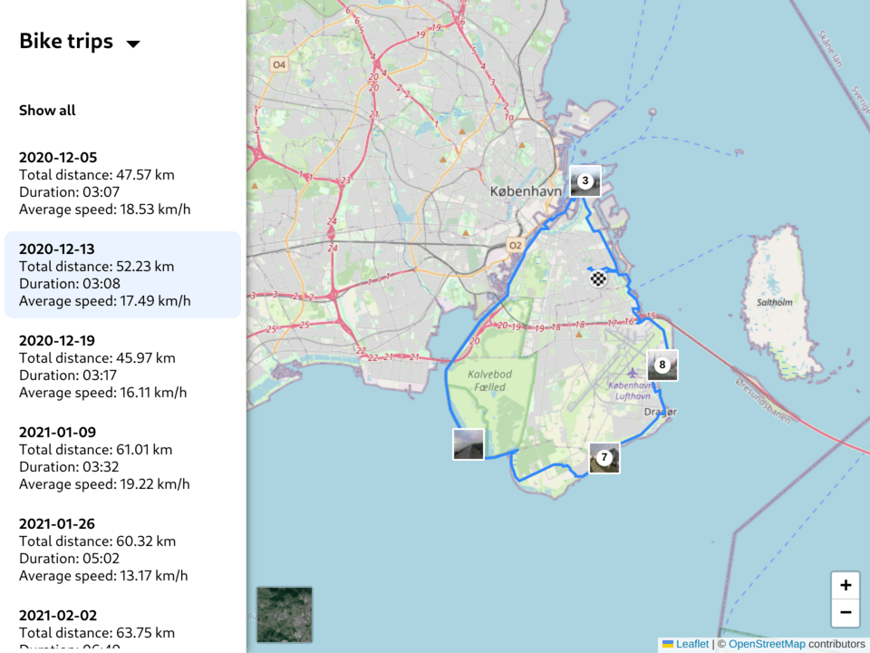

# Trip Share

A web application for sharing trips recorded in the GPX format along with
photos.

## Preview

| Desktop                               | Mobile                              |
| ------------------------------------- | ----------------------------------- |
|  |  |

You can also see a demo at https://zelent.net/trips.

## Description

The idea of the application came when I wanted to share my bike trips with my
family and friends. I needed an easy way to display the route on a map and the
photos I've taken on the trip. I record my bike trips using
[OSMAnd](https://osmand.net/) navigation app and take photos with the location
saved in the image metadata.

The application displays the route recorded with GPS in the GPX format on an
interactive map. The photos are displayed as markers in places they have been
taken, and when clicked on, they are opened in a slideshow view. It is usable
both on desktop and mobile.

The application was developed using [Node.js](https://nodejs.org/),
[TypeScript](https://www.typescriptlang.org/), and
[Next.js](https://nextjs.org/) framework. The pages and components are built
with [React](https://reactjs.org/). The map was created with
[Leaflet](https://leafletjs.com/).

The app is statically generated. GPX files and photos inside "trips" folder are
processed during build time. The data is converted to HTML and JSON, photos are
stripped of EXIF metadata, resized, and optimized. No requests are made to
external APIs, only map tiles are being downloaded.

## Running

To run the application, first install the dependencies:

```
npm install
```

Then, you can run it in development mode:

```
npm run dev
```

To build the application use:

```
npm run build
```

The built files will be in "out" directory.

### Trips data

To display the trips, place them in the "trips" folder with the following
structure:

```
trips/
├── trip-1/
│   ├── trip-1.gpx
│   ├── photo-1.jpg
│   ├── photo-2.jpg
│   ├── photo-3.jpg
├── trip-2/
│   ├── trip-2.gpx
```
